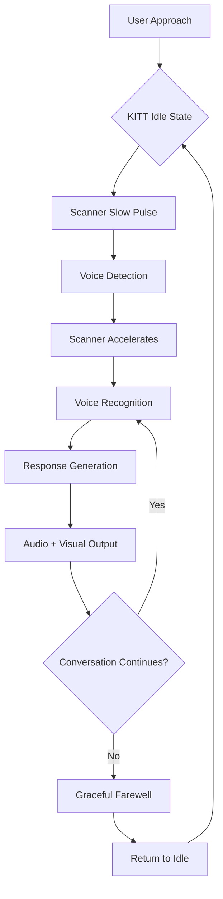
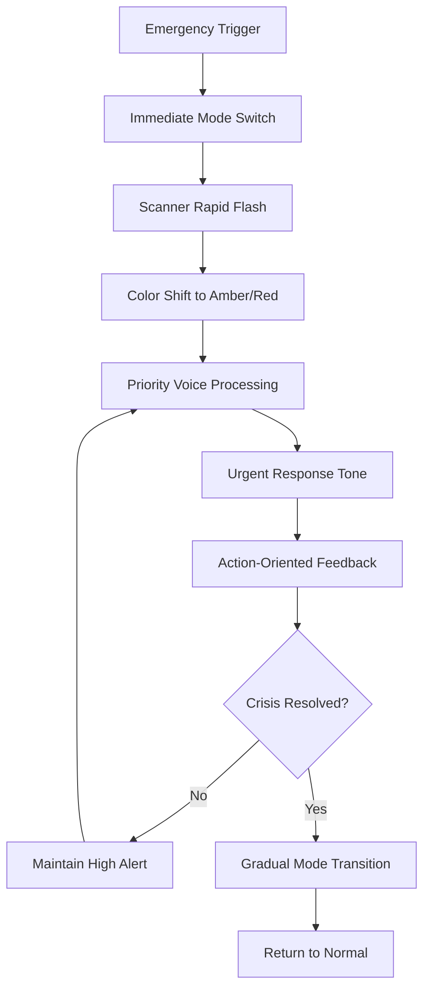
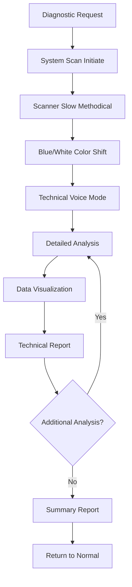

# KITT Interface UX Research & Interaction Design
*Knight Industries Two Thousand - Inspired Conversational AI Interface*

## Executive Summary

This document presents a comprehensive UX research and interaction design for a KITT-inspired conversational AI interface that balances nostalgic appeal with modern functionality. The design creates an immersive, intuitive experience that honors the iconic Knight Rider aesthetic while delivering advanced AI capabilities through natural voice interactions, gesture controls, and adaptive feedback systems.

---

## 1. User Interaction Analysis

### 1.1 Current State Analysis

**Existing Interface Strengths:**
- ✅ Iconic KITT scanner animation creates immediate brand recognition
- ✅ Red/black color scheme establishes nostalgic connection
- ✅ Real-time audio visualization provides clear feedback
- ✅ Status indicators (MIC, CPU, LINK) show system state
- ✅ Large, accessible voice activation button

**Identified Enhancement Opportunities:**
- 🔧 Limited interaction modalities (only voice + single button)
- 🔧 No gesture recognition or alternative input methods
- 🔧 Static interface doesn't adapt to user proficiency
- 🔧 Lacks personality expression beyond visual aesthetics
- 🔧 No contextual help or progressive disclosure
- 🔧 Missing mode-specific interfaces (normal vs advanced operations)

### 1.2 User Mental Models

**KITT Expectations (from Knight Rider legacy):**
- Intelligent, proactive AI companion
- Sophisticated yet approachable personality
- Advanced capabilities hidden behind simple interactions
- Immediate response to voice commands
- Anticipatory assistance and warnings
- Seamless vehicle/system integration

**Modern AI Assistant Expectations:**
- Natural language understanding
- Context-aware conversations
- Multi-modal interactions (voice, touch, gesture)
- Personalization and learning
- Privacy and control
- Accessibility features

### 1.3 Interaction Hierarchy

```
Primary Interactions (95% of use)
├── Voice Activation/Deactivation
├── Natural Language Conversation
├── Emergency/Quick Commands
└── Basic Settings Access

Secondary Interactions (4% of use)
├── Mode Switching (Normal/Pursuit/Diagnostic)
├── Gesture Controls
├── Advanced Configuration
└── Conversation History Navigation

Tertiary Interactions (1% of use)
├── System Diagnostics
├── Developer/Debug Tools
├── Voice Training
└── Integration Management
```

---

## 2. Gesture Controls & Voice Commands Design

### 2.1 Gesture Control System

#### 2.1.1 Touch/Tap Gestures
```
Single Tap (Voice Button)     → Activate/Deactivate Voice
Double Tap (Voice Button)     → Emergency Mode
Long Press (Voice Button)     → Mode Selection Menu
Swipe Up (Interface)          → Expand to Full View
Swipe Down (Interface)        → Minimize/Compact View
Swipe Left/Right (History)    → Navigate Conversations
Pinch In/Out                  → Zoom Scanner Detail
```

#### 2.1.2 Air Gestures (Advanced)
```
Wave Hand                     → Wake KITT from Sleep
Point at Interface           → Focus/Attention Mode
Thumbs Up                    → Confirm Action
Thumbs Down                  → Cancel/Reject
Open Palm (Stop)             → Emergency Stop All
Finger to Lips               → Silent Mode
```

#### 2.1.3 Multi-Touch Patterns
```
Two-Finger Tap               → Quick Settings
Three-Finger Tap             → Diagnostic Mode
Four-Finger Swipe Up         → Emergency Contact
Spread Fingers               → Expand All Information
```

### 2.2 Voice Command Vocabulary

#### 2.2.1 Activation Commands
```
Primary Activators:
- "Hey KITT"
- "KITT, are you there?"
- "Knight Industries"
- "Scanner active"

Personality-Rich Alternatives:
- "Good morning, buddy"
- "KITT, I need you"
- "Partner, let's roll"
- "Scan for trouble"
```

#### 2.2.2 Mode Commands
```
Normal Mode:
- "KITT, normal mode"
- "Standard operations"
- "Regular assistance"

Pursuit Mode:
- "KITT, pursuit mode"
- "Emergency operations"
- "High priority mode"
- "Battle stations"

Diagnostic Mode:
- "KITT, run diagnostics"
- "System check"
- "Technical analysis"
- "Full scan mode"
```

#### 2.2.3 Control Commands
```
Conversation Control:
- "Stop talking" / "Pause"
- "Continue" / "Go on"
- "Repeat that"
- "Speak slower/faster"
- "Lower/raise volume"

Navigation:
- "Show history"
- "Previous conversation"
- "Today's discussions"
- "Search for [topic]"

Settings:
- "Change voice"
- "Adjust personality"
- "Privacy mode"
- "Silent operation"
```

#### 2.2.4 Natural Language Patterns
```
Information Requests:
- "What do you know about..."
- "Tell me more about..."
- "Explain [concept]"
- "Research [topic]"

Task Requests:
- "Help me with..."
- "I need to..."
- "Can you assist with..."
- "Let's work on..."

Emotional Expressions:
- "I'm frustrated"
- "This is confusing"
- "Great job, KITT"
- "Thank you, partner"
```

---

## 3. User Flow Design - Multiple Modes

### 3.1 Normal Mode Flow



**Normal Mode Characteristics:**
- Friendly, conversational tone
- Moderate scanner speed
- Standard red color palette
- Patient response timing
- Helpful suggestions offered

### 3.2 Pursuit Mode Flow



**Pursuit Mode Characteristics:**
- Urgent, focused tone
- Rapid scanner animation
- Enhanced red/amber colors
- Immediate response priority
- Actionable intelligence focus

### 3.3 Diagnostic Mode Flow



**Diagnostic Mode Characteristics:**
- Technical, precise language
- Analytical scanner pattern
- Blue/white color scheme
- Detailed data presentation
- System status emphasis

### 3.4 Mode Transition Design

#### 3.4.1 Seamless Transitions
```
Normal → Pursuit:
- Scanner speed increases 300%
- Color shifts to amber/red over 0.5s
- Voice tone becomes urgent
- Background changes to alert pattern

Pursuit → Normal:
- Gradual speed reduction over 2s
- Color fade back to standard red
- Voice returns to friendly tone
- Confirmation of mode change

Any Mode → Diagnostic:
- Scanner stops, then systematic sweep
- Color transition to blue/white
- Interface expands to show data
- Voice becomes technical/precise
```

### 3.5 Cross-Mode Interaction Patterns

#### 3.5.1 Context Preservation
- Previous conversation context maintained across modes
- User preferences persist through mode changes
- Important information flagged for mode-appropriate presentation

#### 3.5.2 Mode-Specific Adaptations
```
Normal Mode Adaptations:
- Casual conversation style
- Personal anecdotes and humor
- Longer response tolerance
- Proactive helpful suggestions

Pursuit Mode Adaptations:
- Bullet-point information delivery
- Priority-based response ordering
- Time-critical warnings
- Action-focused recommendations

Diagnostic Mode Adaptations:
- Technical terminology accepted
- Detailed system information
- Performance metrics displayed
- Troubleshooting workflows
```

---

## 4. Feedback Mechanisms Design

### 4.1 Visual Feedback System

#### 4.1.1 Scanner Animation States
```css
/* Scanner Animation Specifications */
.scanner-idle {
  animation: pulse 3s ease-in-out infinite;
  opacity: 0.3;
  speed: 0.5x;
}

.scanner-listening {
  animation: sweep 1s linear infinite;
  opacity: 0.8;
  speed: 1x;
  glow: 5px;
}

.scanner-processing {
  animation: rapid-sweep 0.3s linear infinite;
  opacity: 1.0;
  speed: 3x;
  glow: 10px;
}

.scanner-speaking {
  animation: voice-sync 0.1s ease-in-out infinite;
  opacity: 0.9;
  speed: variable (sync to audio);
  pulse-effect: true;
}

.scanner-error {
  animation: flash 0.2s linear 3;
  color: #ff4444;
  speed: 0x (stopped);
}
```

#### 4.1.2 Color Psychology & Semantics
```
State Colors:
- Idle: Deep Red (#8B0000) - Dormant but ready
- Active: Bright Red (#FF0000) - Classic KITT
- Processing: Pulsing Red (#FF3333) - Working
- Speaking: Synchronized Red - Audio reactive
- Pursuit: Amber/Red (#FF8000) - High alert
- Diagnostic: Blue/White (#4169E1) - Technical
- Error: Flashing Red (#FF4444) - Attention needed
- Success: Green Flash (#00FF00) - Confirmation
```

#### 4.1.3 Audio Visualization Enhancements
```
Voice Level Bars:
- Height: Audio amplitude
- Color: State-dependent
- Glow: Intensity-based
- Pattern: Frequency-responsive
- Decay: Natural fade

Scanner Sync:
- Speed matches speech rate
- Intensity follows volume
- Pauses for user speech
- Anticipates response end
```

### 4.2 Audio Feedback System

#### 4.2.1 KITT Personality Audio Cues
```
System Sounds:
- Activation: Classic KITT startup chime (0.8s)
- Mode Switch: Distinctive transition tone (0.5s)
- Processing: Subtle electronic hum (background)
- Completion: Soft confirmation beep (0.3s)
- Error: Concerned KITT-style alert (1.0s)
- Sleep: Gentle power-down sound (1.2s)

Voice Characteristics:
- Base: Deep, confident, slight electronic resonance
- Normal: Friendly, conversational, warm
- Pursuit: Urgent, focused, rapid delivery
- Diagnostic: Precise, technical, methodical
- Error: Concerned but reassuring
```

#### 4.2.2 Spatial Audio Design
```
Audio Positioning:
- Voice: Center, intimate distance
- Scanner: Wide stereo field
- Alerts: Directional based on urgency
- Background: Subtle ambient processing

Volume Dynamics:
- Auto-ducking during user speech
- Intelligent noise gate
- Environmental adaptation
- Accessibility compliance
```

### 4.3 Haptic Feedback System

#### 4.3.1 Mobile Device Haptics
```javascript
// Haptic Feedback Patterns
const hapticPatterns = {
  activation: [100, 50, 100],           // Strong-weak-strong
  modeSwitch: [200, 100, 50, 100, 50],  // Distinctive pattern
  processing: [20, 20, 20, 20],         // Gentle pulse
  completion: [150],                     // Single strong
  error: [100, 50, 100, 50, 100],      // Alert pattern
  voiceStart: [50],                     // Gentle tap
  voiceEnd: [30]                        // Soft release
};
```

#### 4.3.2 Desktop Haptic Alternatives
```
Visual Haptics (Desktop):
- Button press: Subtle scale animation
- Mode switch: Interface shake effect
- Processing: Gentle pulsing elements
- Error: Red border flash
- Success: Green glow effect

Audio Haptics:
- Low-frequency audio tones
- Stereo panning effects
- Volume modulation
- Subsonic feedback (if speakers support)
```

### 4.4 Multi-Modal Feedback Coordination

#### 4.4.1 Feedback Synchronization
```
Coordinated Responses:
1. User speaks
   → Visual: Scanner reacts to voice
   → Audio: Processing hum begins
   → Haptic: Gentle acknowledgment

2. KITT responds
   → Visual: Scanner syncs to speech
   → Audio: Voice + ambient sounds
   → Haptic: Pulse with emphasis words

3. Mode change
   → Visual: Color/animation transition
   → Audio: Mode transition sound
   → Haptic: Distinctive pattern
```

#### 4.4.1 Accessibility Integration
```
Low Vision Support:
- High contrast mode
- Screen reader compatibility
- Audio descriptions of visual elements
- Voice-only interaction mode

Hearing Impaired Support:
- Visual sound indicators
- Haptic audio replacement
- Text display of all audio
- Vibration pattern language

Motor Impaired Support:
- Voice-only operation
- Large touch targets
- Gesture alternatives
- Dwell-time activation
```

---

## 5. Fun/Nostalgic vs Functional Balance

### 5.1 Nostalgic Elements Integration

#### 5.1.1 Visual Nostalgia
```
Classic KITT Elements:
✓ Red scanner animation (signature feature)
✓ Black/red color scheme
✓ Retro-futuristic typography
✓ Geometric interface elements
✓ Pulsing status indicators

Modern Enhancements:
✓ High-resolution graphics
✓ Smooth animations (60fps)
✓ Responsive design
✓ Accessibility features
✓ Touch-friendly interactions
```

#### 5.1.2 Audio Nostalgia
```
KITT Voice Characteristics:
- Deep, resonant tone
- Slight electronic processing
- Confident delivery style
- Subtle British accent influence
- Professional but friendly

Modern Voice Features:
- Natural language processing
- Emotional recognition
- Context-aware responses
- Conversation memory
- Personality adaptation
```

#### 5.1.3 Personality Nostalgia
```
Classic KITT Personality Traits:
- Intelligent and analytical
- Loyal and protective
- Slightly sarcastic humor
- Professional competence
- Caring but independent

Modern Personality Enhancements:
- Learning and adaptation
- Emotional intelligence
- Cultural awareness
- Privacy consciousness
- Ethical reasoning
```

### 5.2 Functional Modern Features

#### 5.2.1 Performance Optimizations
```
Technical Improvements:
- Sub-200ms response latency
- Offline conversation history
- Bandwidth-efficient audio
- Battery optimization
- Security encryption

User Experience Improvements:
- Multi-device synchronization
- Context preservation
- Conversation search
- Smart notifications
- Adaptive interface
```

#### 5.2.2 Integration Capabilities
```
Modern AI Features:
- Web search integration
- Calendar management
- Email assistance
- File organization
- Task automation

Smart Device Integration:
- IoT device control
- Smart home management
- Vehicle integration
- Health monitoring
- Location services
```

### 5.3 Balance Implementation Strategy

#### 5.3.1 Progressive Enhancement
```
Entry Level (Nostalgic Focus):
- Classic KITT appearance
- Simple voice interaction
- Basic scanner animation
- Familiar personality

Advanced Level (Functional Focus):
- Modern AI capabilities
- Complex task management
- Multi-modal interaction
- Advanced integrations
```

#### 5.3.2 User Choice Architecture
```
Personality Slider:
Classic KITT ←→ Modern AI
- Voice processing style
- Response formality
- Feature availability
- Interface complexity

Functionality Selector:
Entertainment ←→ Productivity
- Feature prioritization
- Interface optimization
- Interaction patterns
- Information density
```

---

## 6. Progressive Disclosure Design

### 6.1 Information Architecture Layers

#### 6.1.1 Layer 1: Essential Interface
```
Always Visible:
- KITT scanner animation
- Voice activation button
- Basic status indicators
- Current conversation display

Interaction:
- Voice activation/deactivation
- Basic conversation
- Emergency commands
- Simple settings
```

#### 6.1.2 Layer 2: Contextual Features
```
Appears When Relevant:
- Mode selection options
- Conversation history access
- Advanced voice commands
- Personality adjustments

Triggers:
- User proficiency detection
- Feature discovery prompts
- Error recovery needs
- Advanced use cases
```

#### 6.1.3 Layer 3: Expert Features
```
Hidden Until Requested:
- System diagnostics
- API integrations
- Developer tools
- Advanced configurations

Access Methods:
- Specific voice commands
- Expert gesture sequences
- Settings deep-dive
- Developer mode activation
```

### 6.2 Progressive Disclosure Mechanisms

#### 6.2.1 User Proficiency Detection
```javascript
// Proficiency Scoring Algorithm
const proficiencyIndicators = {
  commandVariety: 0.3,      // Different command types used
  sessionLength: 0.2,       // Average conversation duration
  featureUsage: 0.2,        // Advanced features utilized
  errorRecovery: 0.15,      // Successful error handling
  helpRequests: -0.15       // Negative indicator
};

function calculateProficiency(userHistory) {
  // Track user interaction patterns
  // Reveal features based on demonstrated capability
  // Adapt interface complexity accordingly
}
```

#### 6.2.2 Contextual Feature Revelation
```
Discovery Triggers:
1. User struggles with basic command
   → Reveal gesture alternatives
   
2. User asks about advanced features
   → Show mode selection options
   
3. User demonstrates expertise
   → Unlock diagnostic capabilities
   
4. User requests customization
   → Reveal personality controls
```

### 6.3 Adaptive Interface Elements

#### 6.3.1 Scanner Complexity Scaling
```
Beginner Level:
- Simple left-right sweep
- Single red color
- Slow, predictable timing

Intermediate Level:
- Variable speed based on activity
- Color changes for different states
- Additional status indicators

Expert Level:
- Complex scanning patterns
- Full spectrum color usage
- Detailed system information
- Real-time performance metrics
```

#### 6.3.2 Voice Command Sophistication
```
Beginner Commands:
- "KITT, help me"
- "What can you do?"
- "Talk to me"

Intermediate Commands:
- "Switch to pursuit mode"
- "Show conversation history"
- "Adjust your personality"

Expert Commands:
- "Run full system diagnostics"
- "Analyze conversation patterns"
- "Execute multi-step workflow"
```

---

## 7. Onboarding Experience Design

### 7.1 First-Time User Journey

#### 7.1.1 Initial Encounter
```
Scene: User opens KITT interface for first time

Visual: 
- Dark screen with subtle scanner pulse
- "KNIGHT INDUSTRIES" text appears
- Scanner begins slow activation sequence

Audio:
- Silence, then soft electronic startup sounds
- Classic KITT activation chime (nostalgic recognition)

KITT First Words:
"Good morning. I'm KITT - Knight Industries Two Thousand. 
I'm here to assist you with conversation, research, and 
intelligent collaboration. Shall we begin with a proper 
introduction?"
```

#### 7.1.2 Personality Introduction
```
KITT Personality Establishment:
"I'm equipped with advanced conversational abilities and 
a vast knowledge base. Think of me as your intelligent 
partner - I'm here to help, learn from our interactions, 
and adapt to your communication style. I promise to be 
both capable and considerate."

User Response Encouraged:
"What would you like to know about me, or would you 
prefer to tell me about yourself first?"
```

### 7.2 Capability Demonstration

#### 7.2.1 Feature Discovery Sequence
```
Progressive Capability Reveal:

1. Basic Conversation (30 seconds)
   KITT: "Let's start with a simple conversation. 
   Ask me anything you're curious about."
   
2. Voice Control Demo (30 seconds)
   KITT: "Notice how I respond to your natural speech. 
   You can interrupt me anytime - just start talking."
   
3. Mode Preview (45 seconds)
   KITT: "I have different modes for different situations. 
   Say 'show me your modes' to see what I can do."
   
4. Memory Introduction (60 seconds)
   KITT: "I'll remember our conversations. I learn about 
   your preferences and can reference past discussions."
```

#### 7.2.2 Interactive Tutorials
```
Guided Interaction Examples:

Voice Command Training:
KITT: "Try saying 'KITT, change your voice' to hear 
different options."
→ User tries command
→ KITT demonstrates voice variations
→ User selects preference

Gesture Introduction:
KITT: "Double-tap my scanner to access emergency mode. 
Go ahead, try it."
→ User performs gesture
→ Interface demonstrates mode change
→ KITT explains the feature

Personality Adjustment:
KITT: "Tell me to be more formal or casual, and I'll 
adapt my communication style to your preference."
→ User requests change
→ KITT immediately adapts
→ User experiences personalization
```

### 7.3 Trust Building & Expectation Setting

#### 7.3.1 Privacy & Security Introduction
```
KITT Privacy Explanation:
"Your privacy is paramount. Our conversations are encrypted 
and stored securely. I learn from our interactions to serve 
you better, but I never share personal information. You can 
ask me to forget specific topics or conversations anytime."

User Control Demonstration:
- "Say 'privacy mode' to limit data collection"
- "Say 'forget conversation' to delete history"
- "Say 'show me my data' to review stored information"
```

#### 7.3.2 Capability Boundaries
```
Honest Capability Communication:
"I'm quite capable, but I do have limitations. I'll always 
tell you when I don't know something or can't help with a 
particular request. I'll never pretend to have abilities I 
don't possess."

Error Handling Preview:
"If something goes wrong, I'll guide you through recovery. 
I learn from mistakes to improve our future interactions."
```

### 7.4 Personalization Setup

#### 7.4.1 Preference Discovery
```
Conversational Preference Learning:
KITT: "I'd like to learn your communication preferences. 
Do you prefer:
- Direct, concise responses or detailed explanations?
- Formal language or casual conversation?
- Immediate answers or thoughtful discussions?"

Usage Pattern Understanding:
"What types of tasks will you primarily use me for?
- General conversation and questions
- Work and productivity assistance  
- Learning and research
- Entertainment and companionship"
```

#### 7.4.2 Interface Customization
```
Visual Preference Setup:
KITT: "Let's customize my appearance. Say 'show interface 
options' to see different scanner styles, colors, and 
complexity levels."

Mode Preference Establishment:
"Which of my modes interests you most?
- Normal mode for everyday conversation
- Pursuit mode for urgent tasks and quick responses
- Diagnostic mode for technical analysis and troubleshooting"
```

### 7.5 Onboarding Completion

#### 7.5.1 Relationship Establishment
```
Partnership Declaration:
KITT: "Excellent! We're now properly introduced. I'm looking 
forward to our partnership. Remember, I'm here whenever you 
need assistance, conversation, or collaboration. 

How would you like to begin our first real conversation?"
```

#### 7.5.1 Ongoing Learning Promise
```
Continuous Improvement Commitment:
"I'll continue learning about your preferences and needs 
through our interactions. If I ever respond in a way that 
doesn't suit you, just let me know and I'll adjust.

Our partnership will evolve and improve over time."
```

---

## 8. Implementation Specifications

### 8.1 Technical Requirements

#### 8.1.1 Performance Targets
```
Response Latency:
- Voice activation: <100ms
- Mode switching: <200ms  
- Gesture recognition: <150ms
- Visual feedback: <50ms
- Audio feedback: <100ms

Animation Smoothness:
- Scanner animation: 60fps
- Mode transitions: 60fps
- UI responsiveness: 120fps (on capable devices)
- Audio visualization: Real-time (no lag)
```

#### 8.1.2 Device Compatibility
```
Primary Targets:
- Modern browsers (Chrome 90+, Firefox 88+, Safari 14+)
- Mobile devices (iOS 14+, Android 10+)
- Desktop computers (Windows 10+, macOS 11+)
- Tablet devices (iPad Pro, Android tablets)

Fallback Support:
- Older browsers: Simplified animations
- Low-power devices: Reduced visual effects
- Slow connections: Progressive enhancement
- Accessibility tools: Full compatibility
```

### 8.2 Development Framework Integration

#### 8.2.1 Next.js Component Architecture
```typescript
// Component Structure
interface KITTInterface {
  mode: 'normal' | 'pursuit' | 'diagnostic';
  personality: PersonalityConfig;
  userProficiency: ProficiencyLevel;
  accessibility: AccessibilitySettings;
}

interface PersonalityConfig {
  formality: number;      // 0-1 scale
  verbosity: number;      // 0-1 scale
  humor: number;          // 0-1 scale
  nostalgia: number;      // 0-1 scale
}
```

#### 8.2.2 State Management
```typescript
// Redux/Context state structure
interface KITTState {
  interface: InterfaceState;
  conversation: ConversationState;
  user: UserState;
  system: SystemState;
}

// Gesture recognition integration
interface GestureState {
  enabled: boolean;
  sensitivity: number;
  customPatterns: GesturePattern[];
  accessibility: boolean;
}
```

---

## 9. Usability Testing & Validation

### 9.1 Testing Scenarios

#### 9.1.1 First-Time User Testing
```
Test Objectives:
- Time to successful first interaction
- Understanding of capabilities
- Emotional response to personality
- Completion of onboarding flow

Success Metrics:
- <2 minutes to first successful conversation
- >80% correct capability expectations
- >4/5 emotional appeal rating
- >90% onboarding completion rate
```

#### 9.1.2 Expert User Testing
```
Test Objectives:
- Advanced feature discovery
- Mode switching efficiency
- Gesture command adoption
- Long-term satisfaction

Success Metrics:
- <30 seconds to mode switching
- >70% gesture command usage
- >85% feature satisfaction
- >4.5/5 long-term rating
```

### 9.2 Accessibility Validation

#### 9.2.1 Standards Compliance
```
WCAG 2.1 AA Requirements:
✓ Color contrast ratios (4.5:1 minimum)
✓ Keyboard navigation support
✓ Screen reader compatibility
✓ Focus management
✓ Alternative text for all visual elements

Additional Considerations:
✓ Voice-only operation mode
✓ High contrast visual options
✓ Motion sensitivity settings
✓ Cognitive load optimization
```

### 9.3 Performance Benchmarking

#### 9.3.1 Technical Metrics
```
Automated Testing:
- Load time measurement
- Animation frame rate monitoring
- Memory usage tracking
- Network usage optimization
- Battery impact assessment

User Experience Metrics:
- Task completion time
- Error recovery success
- Feature adoption rates
- User satisfaction scores
- Retention measurements
```

---

## 10. Future Enhancement Roadmap

### 10.1 Near-Term Enhancements (3-6 months)

#### 10.1.1 Advanced Gesture Recognition
```
Planned Features:
- Computer vision gesture tracking
- Custom gesture creation
- Air gesture recognition
- Eye tracking integration (where available)
- Gesture learning system
```

#### 10.1.2 Enhanced Personality System
```
Planned Features:
- Emotional state recognition
- Dynamic personality adaptation
- Multiple personality presets
- Seasonal personality variations
- Cultural sensitivity options
```

### 10.2 Long-Term Vision (6-18 months)

#### 10.2.1 Augmented Reality Integration
```
AR Features:
- Holographic KITT interface
- Spatial gesture controls
- Environmental awareness
- 3D information visualization
- Immersive conversation mode
```

#### 10.2.2 Advanced AI Capabilities
```
AI Enhancements:
- Predictive conversation assistance
- Emotional intelligence advancement
- Multi-agent collaboration
- Autonomous task execution
- Advanced learning algorithms
```

---

## Conclusion

This comprehensive UX design creates a KITT-inspired interface that successfully balances nostalgic appeal with modern functionality. The design honors the iconic Knight Rider aesthetic while delivering advanced conversational AI capabilities through intuitive interactions, adaptive feedback systems, and progressive feature disclosure.

The implementation prioritizes accessibility, performance, and user satisfaction while maintaining the distinctive KITT personality that users expect. Through careful attention to visual design, audio characteristics, and interaction patterns, this interface creates an engaging and memorable user experience that evolves with user proficiency and needs.

The progressive disclosure system ensures that both newcomers and expert users can effectively utilize the system, while the multi-modal feedback mechanisms provide rich, satisfying interactions across different devices and accessibility requirements.

This design framework provides a solid foundation for creating a truly exceptional KITT-inspired AI interface that will delight users while delivering powerful conversational AI capabilities.

---

*Document Version: 1.0*  
*Last Updated: January 2025*  
*Next Review: March 2025*